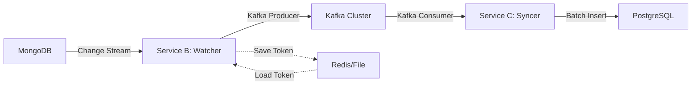

# Design Document: CDC Pipeline

## Overview

The CDC (Change Data Capture) pipeline consists of two independent Go services that work together to replicate data changes from MongoDB to PostgreSQL in real-time. The architecture prioritizes zero data loss, high throughput, and fault tolerance through careful use of resume tokens, batch processing, and idempotent operations.

**Service B (Watcher)** monitors MongoDB change streams and publishes events to Kafka with guaranteed delivery semantics. It persists resume tokens after each successful Kafka write to enable recovery from any point in the event stream.

**Service C (Syncer)** consumes messages from Kafka and writes them to PostgreSQL using batch inserts and worker pools for maximum throughput. It implements idempotent writes using UPSERT semantics to handle duplicate messages gracefully.

Both services implement graceful shutdown, structured logging, and follow SOLID principles for maintainability.

## Architecture

### System Diagram



### Data Flow

1. **Change Detection**: MongoDB generates change events for insert, update, and replace operations
2. **Event Capture**: Watcher receives change events through MongoDB change stream API
3. **Event Publishing**: Watcher publishes events to Kafka topic with async producer
4. **Token Persistence**: After successful Kafka write, Watcher saves resume token to Redis or local file
5. **Event Consumption**: Syncer consumes messages from Kafka using consumer group
6. **Batch Buffering**: Syncer buffers messages in memory until flush condition is met (1000 messages or 500ms)
7. **Database Write**: Syncer writes batch to PostgreSQL using COPY protocol or batch INSERT with UPSERT semantics
8. **Offset Commit**: After successful PostgreSQL write, Syncer commits Kafka offsets

### Technology Stack

- **Language**: Go 1.21+
- **MongoDB Driver**: go.mongodb.org/mongo-driver/mongo
- **Kafka Client**: github.com/segmentio/kafka-go
- **PostgreSQL Driver**: github.com/jackc/pgx/v5
- **Logging**: go.uber.org/zap
- **Configuration**: github.com/spf13/viper
- **Storage**: Redis (optional) or local file for resume tokens

## Components and Interfaces

### Service B: Watcher

#### Component Structure

```
watcher/
├── main.go                 # Entry point, dependency injection
├── config/
│   └── config.go          # Configuration loading and validation
├── changestream/
│   ├── watcher.go         # Change stream monitoring logic
│   └── types.go           # Change event types
├── producer/
│   ├── kafka.go           # Kafka producer implementation
│   └── types.go           # Message types
├── token/
│   ├── store.go           # Resume token storage interface
│   ├── redis.go           # Redis implementation
│   └── file.go            # File-based implementation
└── logger/
    └── logger.go          # Structured logging setup
```

#### Key Interfaces

**ChangeStreamWatcher Interface**:
```go
type ChangeStreamWatcher interface {
    // Watch starts monitoring the change stream from the given resume token
    // Returns a channel of change events and an error channel
    Watch(ctx context.Context, resumeToken *bson.Raw) (<-chan ChangeEvent, <-chan error)
    
    // Close gracefully shuts down the watcher
    Close() error
}
```

**KafkaProducer Interface**:
```go
type KafkaProducer interface {
    // PublishAsync sends a message to Kafka asynchronously
    // Returns a channel that receives the result when write completes
    PublishAsync(ctx context.Context, msg Message) <-chan ProduceResult
    
    // Close flushes pending messages and closes the producer
    Close() error
}
```

**TokenStore Interface**:
```go
type TokenStore interface {
    // Save persists the resume token
    Save(ctx context.Context, token bson.Raw) error
    
    // Load retrieves the last saved resume token
    // Returns nil if no token exists
    Load(ctx context.Context) (*bson.Raw, error)
}
```

#### Change Event Processing Flow

1. **Initialization**:
   - Load configuration from environment or file
   - Initialize MongoDB connection with retry logic
   - Initialize Kafka producer with async configuration
   - Initialize token store (Redis or file-based)
   - Load last resume token from storage

2. **Main Loop**:
   - Open change stream with resume token (if available)
   - For each change event:
     - Extract operation type (insert, update, replace)
     - Extract document data and metadata
     - Serialize to JSON
     - Publish to Kafka asynchronously
     - Wait for Kafka delivery confirmation
     - Save resume token to storage
     - Log success with event details

3. **Error Handling**:
   - Transient errors: Retry with exponential backoff (max 5 retries)
   - Network errors: Reconnect to MongoDB/Kafka
   - Fatal errors: Log and exit with non-zero status

4. **Graceful Shutdown**:
   - Catch SIGTERM/SIGINT signals
   - Stop consuming from change stream
   - Wait for in-flight Kafka writes to complete
   - Save current resume token
   - Close all connections
   - Exit with status 0

### Service C: Syncer

#### Component Structure

```
syncer/
├── main.go                 # Entry point, dependency injection
├── config/
│   └── config.go          # Configuration loading and validation
├── consumer/
│   ├── kafka.go           # Kafka consumer implementation
│   └── types.go           # Message types
├── writer/
│   ├── postgres.go        # PostgreSQL writer with batching
│   ├── batch.go           # Batch buffer management
│   └── types.go           # Data types
├── worker/
│   └── pool.go            # Worker pool implementation
└── logger/
    └── logger.go          # Structured logging setup
```

#### Key Interfaces

**KafkaConsumer Interface**:
```go
type KafkaConsumer interface {
    // Consume returns a channel of messages from Kafka
    Consume(ctx context.Context) (<-chan Message, error)
    
    // Commit commits the offset for the given message
    Commit(ctx context.Context, msg Message) error
    
    // Close gracefully shuts down the consumer
    Close() error
}
```

**PostgresWriter Interface**:
```go
type PostgresWriter interface {
    // WriteBatch writes a batch of records to PostgreSQL
    // Uses COPY protocol for large batches, prepared statements for small batches
    WriteBatch(ctx context.Context, records []Record) error
    
    // Close closes the database connection pool
    Close() error
}
```

**BatchBuffer Interface**:
```go
type BatchBuffer interface {
    // Add adds a record to the buffer
    // Returns true if buffer should be flushed
    Add(record Record) bool
    
    // Flush returns all buffered records and clears the buffer
    Flush() []Record
    
    // Size returns the current buffer size
    Size() int
}
```

**WorkerPool Interface**:
```go
type WorkerPool interface {
    // Start initializes worker goroutines
    Start(ctx context.Context, numWorkers int)
    
    // Submit sends a message to the worker pool for processing
    Submit(msg Message) error
    
    // Shutdown gracefully stops all workers and waits for completion
    Shutdown(ctx context.Context) error
}
```

#### Message Processing Flow

1. **Initialization**:
   - Load configuration from environment or file
   - Initialize PostgreSQL connection pool (min: 10, max: 50 connections)
   - Initialize Kafka consumer with consumer group
   - Initialize batch buffer (capacity: 1000 messages)
   - Start worker pool (configurable number of workers, default: 10)
   - Start flush timer (500ms interval)

2. **Worker Pool Pattern**:
   - Each worker runs in a separate goroutine
   - Workers receive messages from a shared channel
   - Each worker maintains its own batch buffer
   - Workers coordinate through channels for synchronization

3. **Batch Processing**:
   - Worker receives message from Kafka
   - Deserialize JSON to structured type
   - Add record to worker's batch buffer
   - Check flush conditions:
     - Buffer size >= 1000 messages, OR
     - Time since last flush >= 500ms
   - If flush condition met:
     - Call PostgresWriter.WriteBatch()
     - Commit Kafka offsets for all messages in batch
     - Clear buffer

4. **Database Write Strategy**:
   - For batches < 100 records: Use prepared statement with multi-row INSERT
   - For batches >= 100 records: Use pgx CopyFrom (COPY protocol)
   - All writes use ON CONFLICT DO UPDATE for idempotency
   - Unique constraint on primary key or natural key

5. **Error Handling**:
   - Transient errors: Retry with exponential backoff (max 5 retries)
   - Deadlock errors: Retry immediately (PostgreSQL will resolve)
   - Constraint violations: Log and skip (data integrity issue)
   - Fatal errors: Log and exit with non-zero status

6. **Graceful Shutdown**:
   - Catch SIGTERM/SIGINT signals
   - Stop consuming from Kafka
   - Signal all workers to finish current batch
   - Wait for all workers to flush their buffers
   - Commit final Kafka offsets
   - Close all connections
   - Exit with status 0

## Data Models

### Change Event (MongoDB → Kafka)

```go
type ChangeEvent struct {
    ID            string                 `json:"id"`              // Unique event ID
    OperationType string                 `json:"operation_type"`  // insert, update, replace
    Namespace     Namespace              `json:"namespace"`       // Database and collection
    DocumentKey   map[string]interface{} `json:"document_key"`    // _id field
    FullDocument  map[string]interface{} `json:"full_document"`   // Complete document (for insert/replace)
    UpdateDesc    *UpdateDescription     `json:"update_desc"`     // Update details (for update)
    ClusterTime   primitive.Timestamp    `json:"cluster_time"`    // MongoDB cluster time
    ResumeToken   bson.Raw               `json:"-"`               // Not serialized to Kafka
}

type Namespace struct {
    Database   string `json:"database"`
    Collection string `json:"collection"`
}

type UpdateDescription struct {
    UpdatedFields map[string]interface{} `json:"updated_fields"`
    RemovedFields []string               `json:"removed_fields"`
}
```

### Kafka Message Format

```json
{
  "id": "507f1f77bcf86cd799439011",
  "operation_type": "insert",
  "namespace": {
    "database": "game_db",
    "collection": "players"
  },
  "document_key": {
    "_id": "507f1f77bcf86cd799439011"
  },
  "full_document": {
    "_id": "507f1f77bcf86cd799439011",
    "username": "player123",
    "level": 42,
    "score": 9999,
    "created_at": "2024-01-15T10:30:00Z"
  },
  "cluster_time": {
    "t": 1705318200,
    "i": 1
  }
}
```

### PostgreSQL Schema

```sql
-- Target table for game player data
CREATE TABLE players (
    id VARCHAR(24) PRIMARY KEY,           -- MongoDB _id as string
    username VARCHAR(255) NOT NULL,
    level INTEGER NOT NULL DEFAULT 1,
    score BIGINT NOT NULL DEFAULT 0,
    created_at TIMESTAMP NOT NULL,
    updated_at TIMESTAMP NOT NULL DEFAULT NOW(),
    
    -- Metadata fields
    cdc_operation VARCHAR(20),            -- insert, update, replace
    cdc_timestamp TIMESTAMP NOT NULL,     -- When CDC processed this
    
    -- Indexes for query performance
    CONSTRAINT unique_username UNIQUE (username)
);

CREATE INDEX idx_players_level ON players(level);
CREATE INDEX idx_players_score ON players(score DESC);
CREATE INDEX idx_players_created_at ON players(created_at);
```

### Record Type (Kafka → PostgreSQL)

```go
type PlayerRecord struct {
    ID           string    `db:"id"`
    Username     string    `db:"username"`
    Level        int       `db:"level"`
    Score        int64     `db:"score"`
    CreatedAt    time.Time `db:"created_at"`
    UpdatedAt    time.Time `db:"updated_at"`
    CDCOperation string    `db:"cdc_operation"`
    CDCTimestamp time.Time `db:"cdc_timestamp"`
}
```

## Correctness Properties

*A property is a characteristic or behavior that should hold true across all valid executions of a system—essentially, a formal statement about what the system should do. Properties serve as the bridge between human-readable specifications and machine-verifiable correctness guarantees.*


### Property 1: Change Event Capture Completeness

*For any* sequence of MongoDB operations (insert, update, replace), all operations should be captured by the Watcher and published to Kafka.

**Validates: Requirements 1.1**

### Property 2: Change Event Data Extraction Correctness

*For any* MongoDB change stream event, the extracted operation type and document data should match the original change event data.

**Validates: Requirements 1.3**

### Property 3: Resume Token Persistence Round-Trip

*For any* resume token saved to storage, loading it back should return an equivalent token that allows resuming from the same position in the change stream.

**Validates: Requirements 2.2**

### Property 4: Resume Token Save After Kafka Success

*For any* change event successfully published to Kafka, a resume token should be saved to persistent storage before processing the next event.

**Validates: Requirements 2.1**

### Property 5: Resume Token Retry on Failure

*For any* resume token save operation that fails, the Watcher should retry the save operation with exponential backoff until success or max retries.

**Validates: Requirements 2.4**

### Property 6: Resume Token Storage Backend Equivalence

*For any* resume token, saving and loading through Redis storage should produce the same result as saving and loading through file storage.

**Validates: Requirements 2.5**

### Property 7: Async Producer Non-Blocking Behavior

*For any* Kafka write operation, the producer should return immediately without blocking the change stream processing thread.

**Validates: Requirements 3.2**

### Property 8: Kafka Confirmation Before Token Save

*For any* change event, the resume token save operation should only occur after receiving Kafka delivery confirmation.

**Validates: Requirements 3.3**

### Property 9: Message Serialization Round-Trip

*For any* change event, serializing to JSON and then deserializing should produce an equivalent change event with all data preserved.

**Validates: Requirements 3.5, 4.3**

### Property 10: Consumer Error Resilience

*For any* message consumption failure, the Syncer should continue processing subsequent messages without stopping.

**Validates: Requirements 4.4**

### Property 11: Offset Commit After Database Write

*For any* batch of messages, Kafka offset commits should only occur after successful PostgreSQL write completion.

**Validates: Requirements 4.5**

### Property 12: Message Buffering Before Flush

*For any* sequence of messages received by the Syncer, messages should accumulate in the buffer until a flush condition is met (count or time threshold).

**Validates: Requirements 5.1**

### Property 13: Buffer Clear After Flush

*For any* flush operation that completes successfully, the buffer should be empty and all Kafka offsets for flushed messages should be committed.

**Validates: Requirements 5.4**

### Property 14: Worker Message Distribution

*For any* set of messages consumed from Kafka, all active workers should receive messages for processing (load distribution).

**Validates: Requirements 6.2**

### Property 15: Batch Write Protocol Selection

*For any* batch of messages, if the batch size is less than 100, prepared statements should be used; if 100 or more, the COPY protocol should be used.

**Validates: Requirements 7.4**

### Property 16: Connection Pool Wait on Exhaustion

*For any* database write operation when the connection pool is exhausted, the operation should wait for an available connection rather than failing immediately.

**Validates: Requirements 7.5**

### Property 17: Idempotent Write Operations

*For any* message processed multiple times, the final database state should be identical regardless of how many times the message was processed.

**Validates: Requirements 8.2, 8.5**

### Property 18: Upsert Operation Logging

*For any* upsert operation that completes, the log should indicate whether an insert or update occurred.

**Validates: Requirements 8.4**

### Property 19: Graceful Shutdown Buffer Flush

*For any* Syncer shutdown operation, all buffered messages should be flushed to PostgreSQL before the service exits.

**Validates: Requirements 9.3**

### Property 20: Graceful Shutdown Token Save

*For any* Watcher shutdown operation, the current resume token should be saved to storage before the service exits.

**Validates: Requirements 9.4**

### Property 21: Structured Log Field Completeness

*For any* log event, the log entry should contain all required contextual fields (timestamp, service name, operation type).

**Validates: Requirements 10.3**

### Property 22: Error Log Stack Trace Inclusion

*For any* error that occurs, the error log should include a stack trace and error context information.

**Validates: Requirements 10.5**

### Property 23: Configuration Validation Rejection

*For any* invalid configuration value, the service should reject the configuration and exit with a non-zero status code during startup.

**Validates: Requirements 11.5**

### Property 24: Exponential Backoff Retry Pattern

*For any* transient error (network, connection, timeout), retry attempts should follow an exponential backoff pattern with increasing delays between attempts.

**Validates: Requirements 1.4, 3.4, 12.1, 12.4**

### Property 25: Maximum Retry Count Enforcement

*For any* operation with retry logic, the number of retry attempts should not exceed the configured maximum retry count.

**Validates: Requirements 12.2**

### Property 26: Error Type Classification

*For any* error that occurs, the service should correctly classify it as either retryable or non-retryable and handle it accordingly.

**Validates: Requirements 12.5**

## Error Handling

### Watcher Error Scenarios

**MongoDB Connection Errors**:
- **Detection**: Connection timeout, network unreachable, authentication failure
- **Handling**: Exponential backoff retry (1s, 2s, 4s, 8s, 16s max)
- **Max Retries**: 5 attempts
- **Fatal Condition**: All retries exhausted → log fatal error and exit

**Change Stream Errors**:
- **Detection**: Stream closed, cursor not found, resume token expired
- **Handling**: 
  - Resume token expired: Start from current time, log warning
  - Other errors: Reconnect with exponential backoff
- **Max Retries**: 5 attempts
- **Fatal Condition**: Persistent stream failures → log fatal error and exit

**Kafka Producer Errors**:
- **Detection**: Broker unavailable, message too large, timeout
- **Handling**: 
  - Transient errors: Retry with exponential backoff
  - Message too large: Log error, skip message, continue
- **Max Retries**: 5 attempts
- **Fatal Condition**: Persistent broker unavailability → log fatal error and exit

**Resume Token Storage Errors**:
- **Detection**: Redis connection failure, file write permission denied
- **Handling**: Retry with exponential backoff
- **Max Retries**: 3 attempts
- **Fatal Condition**: Cannot save token → log fatal error and exit (data loss risk)

### Syncer Error Scenarios

**Kafka Consumer Errors**:
- **Detection**: Broker unavailable, consumer group rebalance, offset out of range
- **Handling**:
  - Rebalance: Wait and rejoin consumer group
  - Offset out of range: Reset to earliest or latest based on config
  - Broker unavailable: Retry with exponential backoff
- **Max Retries**: 5 attempts
- **Fatal Condition**: Persistent broker unavailability → log fatal error and exit

**PostgreSQL Connection Errors**:
- **Detection**: Connection refused, authentication failure, network timeout
- **Handling**: Exponential backoff retry (1s, 2s, 4s, 8s, 16s max)
- **Max Retries**: 5 attempts
- **Fatal Condition**: All retries exhausted → log fatal error and exit

**Database Write Errors**:
- **Detection**: Deadlock, constraint violation, serialization failure
- **Handling**:
  - Deadlock: Immediate retry (PostgreSQL resolves automatically)
  - Constraint violation: Log error, skip record, continue
  - Serialization failure: Retry with exponential backoff
- **Max Retries**: 3 attempts for retryable errors
- **Fatal Condition**: Persistent write failures → log fatal error and exit

**Deserialization Errors**:
- **Detection**: Invalid JSON, missing required fields, type mismatch
- **Handling**: Log error with message details, skip message, continue processing
- **No Retries**: Non-retryable error
- **Fatal Condition**: None (skip and continue)

### Error Logging Format

All errors should be logged with the following structure:

```go
logger.Error("operation failed",
    zap.String("service", "watcher"),
    zap.String("operation", "kafka_publish"),
    zap.String("error_type", "retryable"),
    zap.Error(err),
    zap.Stack("stack_trace"),
    zap.Int("retry_attempt", attemptNum),
    zap.Int("max_retries", maxRetries),
)
```

## Testing Strategy

### Dual Testing Approach

The CDC pipeline requires both unit tests and property-based tests for comprehensive coverage:

**Unit Tests**: Focus on specific examples, edge cases, and integration points
- Specific error conditions (connection failures, invalid data)
- Edge cases (empty buffers, single message batches)
- Integration between components (Watcher → Kafka, Kafka → Syncer)
- Configuration validation scenarios

**Property-Based Tests**: Verify universal properties across all inputs
- Data integrity properties (serialization, idempotency)
- Ordering guarantees (token saves, offset commits)
- Error handling patterns (retries, backoff)
- Comprehensive input coverage through randomization

### Property-Based Testing Configuration

**Testing Library**: Use [gopter](https://github.com/leanovate/gopter) for property-based testing in Go

**Test Configuration**:
- Minimum 100 iterations per property test (due to randomization)
- Configurable seed for reproducibility
- Shrinking enabled to find minimal failing cases

**Test Tagging**: Each property test must include a comment referencing the design property:

```go
// Feature: cdc-pipeline, Property 9: Message Serialization Round-Trip
// Validates: Requirements 3.5, 4.3
func TestMessageSerializationRoundTrip(t *testing.T) {
    properties := gopter.NewProperties(nil)
    properties.Property("serialize then deserialize preserves data", 
        prop.ForAll(
            func(event ChangeEvent) bool {
                json, _ := json.Marshal(event)
                var decoded ChangeEvent
                json.Unmarshal(json, &decoded)
                return reflect.DeepEqual(event, decoded)
            },
            genChangeEvent(),
        ),
    )
    properties.TestingRun(t, gopter.ConsoleReporter(false))
}
```

### Unit Testing Strategy

**Watcher Unit Tests**:
- Test MongoDB connection with mock driver
- Test change stream event parsing
- Test resume token save/load with mock storage
- Test Kafka producer with mock broker
- Test graceful shutdown sequence
- Test error handling for each error type

**Syncer Unit Tests**:
- Test Kafka consumer with mock broker
- Test batch buffer flush conditions
- Test PostgreSQL writer with test database
- Test worker pool coordination
- Test graceful shutdown sequence
- Test error handling for each error type

**Integration Tests**:
- End-to-end test with test MongoDB, Kafka, and PostgreSQL instances
- Test data flow from MongoDB → Kafka → PostgreSQL
- Test resume capability after restart
- Test idempotency with duplicate messages
- Test graceful shutdown with in-flight messages

### Performance Testing

**Throughput Benchmarks**:
- Measure messages per second for Watcher
- Measure messages per second for Syncer
- Measure end-to-end latency (MongoDB change → PostgreSQL write)
- Test with varying batch sizes (10, 100, 1000, 10000 messages)

**Load Testing**:
- Sustained load test (1 hour at target throughput)
- Burst load test (10x normal load for 5 minutes)
- Memory usage monitoring during load tests
- Connection pool utilization monitoring

**Failure Recovery Testing**:
- Test resume after Watcher crash
- Test resume after Syncer crash
- Test recovery from Kafka broker failure
- Test recovery from PostgreSQL connection loss
- Verify zero data loss in all scenarios

### Test Data Generators

**Change Event Generator**:
```go
func genChangeEvent() gopter.Gen {
    return gopter.CombineGens(
        gen.Identifier(),           // ID
        gen.OneConstOf("insert", "update", "replace"), // Operation type
        genNamespace(),             // Namespace
        gen.MapOf(gen.Identifier(), gen.AnyString()), // Document
    ).Map(func(values []interface{}) ChangeEvent {
        return ChangeEvent{
            ID:            values[0].(string),
            OperationType: values[1].(string),
            Namespace:     values[2].(Namespace),
            FullDocument:  values[3].(map[string]interface{}),
        }
    })
}
```

**Player Record Generator**:
```go
func genPlayerRecord() gopter.Gen {
    return gopter.CombineGens(
        gen.Identifier(),           // ID
        gen.Identifier(),           // Username
        gen.IntRange(1, 100),       // Level
        gen.Int64Range(0, 1000000), // Score
        genTimestamp(),             // CreatedAt
    ).Map(func(values []interface{}) PlayerRecord {
        return PlayerRecord{
            ID:        values[0].(string),
            Username:  values[1].(string),
            Level:     values[2].(int),
            Score:     values[3].(int64),
            CreatedAt: values[4].(time.Time),
        }
    })
}
```

## Performance Optimizations

### Watcher Performance

**Async Kafka Producer**:
- Non-blocking writes allow change stream processing to continue
- Delivery confirmations handled in separate goroutine
- Batching enabled in Kafka producer (batch size: 100, linger: 10ms)

**Resume Token Caching**:
- Cache resume token in memory
- Only persist to storage after every N successful writes (N=10)
- Trade-off: Potential to replay up to 10 events on restart
- Benefit: Reduced storage I/O by 90%

**Connection Pooling**:
- MongoDB: Single connection with change stream (change streams are single-threaded)
- Kafka: Producer connection pool (3 connections)
- Redis: Connection pool (min: 5, max: 20)

### Syncer Performance

**Batch Insert Optimization**:
- Buffer size: 1000 messages (configurable)
- Flush interval: 500ms (configurable)
- Use COPY protocol for batches >= 100 (10x faster than INSERT)
- Use prepared statements for batches < 100

**Worker Pool Sizing**:
- Default: 10 workers (configurable)
- Each worker has independent batch buffer
- Workers coordinate through buffered channels (capacity: 1000)
- Optimal sizing: Number of CPU cores × 2

**PostgreSQL Connection Pool**:
- Min connections: 10
- Max connections: 50
- Connection lifetime: 30 minutes
- Idle timeout: 5 minutes
- Health check interval: 1 minute

**Memory Management**:
- Pre-allocate batch buffers to avoid GC pressure
- Reuse byte buffers for JSON deserialization
- Use sync.Pool for frequently allocated objects

### Monitoring and Metrics

**Watcher Metrics**:
- `watcher_events_processed_total`: Counter of change events processed
- `watcher_events_published_total`: Counter of events published to Kafka
- `watcher_kafka_publish_duration_seconds`: Histogram of Kafka publish latency
- `watcher_token_save_duration_seconds`: Histogram of token save latency
- `watcher_errors_total`: Counter of errors by type
- `watcher_resume_token_age_seconds`: Gauge of time since last token save

**Syncer Metrics**:
- `syncer_messages_consumed_total`: Counter of Kafka messages consumed
- `syncer_messages_written_total`: Counter of records written to PostgreSQL
- `syncer_batch_size`: Histogram of batch sizes
- `syncer_batch_flush_duration_seconds`: Histogram of batch flush latency
- `syncer_buffer_size`: Gauge of current buffer size
- `syncer_worker_pool_size`: Gauge of active workers
- `syncer_errors_total`: Counter of errors by type

**Alerting Thresholds**:
- Resume token age > 60 seconds: Warning (Watcher may be stuck)
- Error rate > 10 per minute: Warning (investigate error types)
- Buffer size at max for > 5 minutes: Critical (Syncer can't keep up)
- End-to-end latency > 5 seconds: Warning (pipeline slowdown)

## Configuration

### Watcher Configuration

```yaml
# MongoDB Configuration
mongodb:
  uri: "mongodb://localhost:27017"
  database: "game_db"
  collection: "players"
  connection_timeout: "10s"
  
# Kafka Configuration
kafka:
  brokers:
    - "localhost:9092"
  topic: "cdc.game_db.players"
  compression: "snappy"
  batch_size: 100
  batch_timeout: "10ms"
  max_retries: 5
  
# Resume Token Storage
token_storage:
  type: "redis"  # or "file"
  redis:
    addr: "localhost:6379"
    password: ""
    db: 0
    key: "cdc:watcher:resume_token"
  file:
    path: "/var/lib/watcher/resume_token.dat"
    
# Logging
logging:
  level: "info"  # debug, info, warn, error
  format: "json"  # json or console
  
# Performance
performance:
  token_save_interval: 10  # Save token every N messages
```

### Syncer Configuration

```yaml
# Kafka Configuration
kafka:
  brokers:
    - "localhost:9092"
  topic: "cdc.game_db.players"
  consumer_group: "cdc-syncer"
  max_retries: 5
  
# PostgreSQL Configuration
postgres:
  host: "localhost"
  port: 5432
  database: "analytics_db"
  user: "syncer"
  password: "secret"
  min_connections: 10
  max_connections: 50
  connection_timeout: "10s"
  
# Batch Configuration
batch:
  buffer_size: 1000
  flush_interval: "500ms"
  copy_threshold: 100  # Use COPY protocol for batches >= this size
  
# Worker Pool
workers:
  pool_size: 10
  channel_buffer: 1000
  
# Logging
logging:
  level: "info"
  format: "json"
```

## Deployment Considerations

### High Availability

**Watcher HA**:
- Run single instance per MongoDB collection (change streams are single-threaded)
- Use Kubernetes StatefulSet for stable identity
- Store resume tokens in Redis for fast recovery
- Health check endpoint: `/health` (returns 200 if change stream is active)

**Syncer HA**:
- Run multiple instances in Kafka consumer group
- Kafka handles partition assignment and rebalancing
- Use Kubernetes Deployment with multiple replicas
- Health check endpoint: `/health` (returns 200 if consuming messages)

### Resource Requirements

**Watcher**:
- CPU: 0.5 cores (1 core for high-throughput scenarios)
- Memory: 512 MB (1 GB for high-throughput scenarios)
- Network: 10 Mbps (depends on change volume)
- Storage: 100 MB (for local file token storage)

**Syncer**:
- CPU: 2 cores (scales with worker pool size)
- Memory: 2 GB (scales with batch buffer size)
- Network: 50 Mbps (depends on message volume)
- Storage: Minimal (no persistent state)

### Scaling Guidelines

**Horizontal Scaling**:
- Watcher: One instance per MongoDB collection (cannot scale horizontally per collection)
- Syncer: Scale by adding replicas (Kafka partitions should match or exceed replica count)

**Vertical Scaling**:
- Watcher: Increase CPU for faster change stream processing
- Syncer: Increase memory for larger batch buffers, increase CPU for more workers

**Kafka Partitioning**:
- Partition by document ID for even distribution
- Number of partitions should match or exceed Syncer replica count
- Replication factor: 3 (for production)

### Monitoring and Observability

**Logging**:
- Structured JSON logs to stdout
- Log aggregation with ELK stack or similar
- Log retention: 7 days

**Metrics**:
- Prometheus metrics endpoint: `/metrics`
- Grafana dashboards for visualization
- Metrics retention: 30 days

**Tracing**:
- Distributed tracing with OpenTelemetry
- Trace sampling rate: 1% (adjust based on volume)
- Trace retention: 7 days

**Alerting**:
- PagerDuty integration for critical alerts
- Slack notifications for warnings
- Alert routing based on severity
