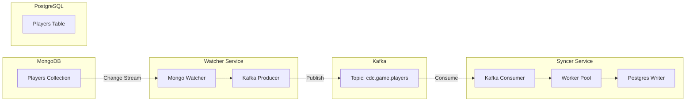

# CDC Pipeline: MongoDB to PostgreSQL

A high-performance, fault-tolerant Change Data Capture (CDC) pipeline built in Go. It synchronizes data from MongoDB to PostgreSQL via Kafka.

## Architecture



## Features

- **Fault Tolerance**: Automatic retries with exponential backoff.
- **Reliability**: Resume tokens ensure no data loss even after restarts.
- **Performance**: Parallel processing with a worker pool and high-speed Postgres `COPY` protocol for large batches.
- **Observability**: Structured logging (Zap), Prometheus metrics, and health checks.

## Setup

### Prerequisites
- Go 1.24+
- MongoDB 4.0+ (with replica set)
- Kafka
- PostgreSQL

### Installation
```bash
git clone https://github.com/watcher/pipeline.git
cd pipeline
go mod download
```

### Running Locally
1. Copy `config.yaml.example` to `config.yaml` and update the connection strings.
2. Run the Watcher:
   ```bash
   go run cmd/watcher/main.go
   ```
3. Run the Syncer:
   ```bash
   go run cmd/syncer/main.go
   ```

## Development

### Running Tests
```bash
go test ./...
```

### Building Docker Images
```bash
docker build -t watcher -f docker/watcher.Dockerfile .
docker build -t syncer -f docker/syncer.Dockerfile .
```

## License
MIT
